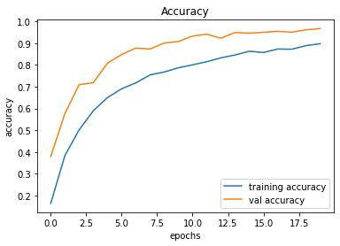
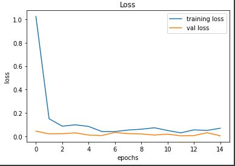
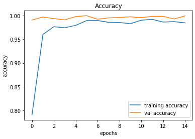
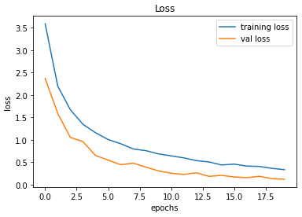

# Project 4

Table of Contents
- [Project 4](#project-4)
- [Introduction](#introduction)
  - [Background](#background)
    - [Level 0 No Driving Automation](#level-0-no-driving-automation)
    - [Level 1 Driver Assistance](#level-1-driver-assistance)
    - [Level 2 Partial Driving Automation](#level-2-partial-driving-automation)
    - [Level 3 Conditional Driving Automation](#level-3-conditional-driving-automation)
    - [Level 4 High Driving Automation](#level-4-high-driving-automation)
    - [Level 5 Full Driving Automation](#level-5-full-driving-automation)
  - [Solving the problem](#solving-the-problem)
  - [Techniques Used](#techniques-used)

# Introduction
Self driving cars and driver assistance is a major field of study in technology today.  Almost all major automakers are looking to improve or develop safer cars or to automate them to drive themselves.  Our project focuses on this problem.  We are developing a Nerual Network that will be able to read and distiguish different road signs and thus improving accuracy.

## Background
Autonomus driving is a major field of research that most major automakers and start up are looking to have a breakthrough or market leading technology in.
Currently there are 6 Levels of autonomy.
### Level 0 No Driving Automation 
This is the lowest form and there really isn't much automation besides an emergency braking system.
### Level 1 Driver Assistance
This can be driving assistance such as adaptive cruise control
### Level 2 Partial Driving Automation
This is when the vehicle can control both steering and acceleratiing and declerating.  The driver has to be in the driver seat and can take control of the car at anytime
### Level 3 Conditional Driving Automation
This is the level where our project comes into play.  It works on environmental detection.  Our project will be actively identifying different road signs.  The driver still must remain alert and ready at this level and ready to take control at any time.
### Level 4 High Driving Automation
The main difference between Level 3 and 4 is that if there is a system failure the automation will not require human intervention since it should be able to correct itself in most cases.
### Level 5 Full Driving Automation
At this level vehicles do not require any human attention.  These cars will no have any driver features such as steering wheels, braking, or gas pedals.

## Solving the problem
To solve this problem we used the GTSRB - (German Traffic Sign Recognition Benchmark) dataset to train our model.  We used over 50,000 images to train the model and tested it vs about 12,000 images.  This is a very time and resource intensive task and each time we trained the model it would take over an hour to complete.

## Techniques Used
